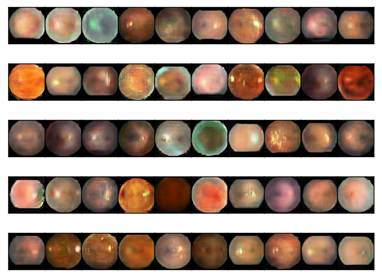
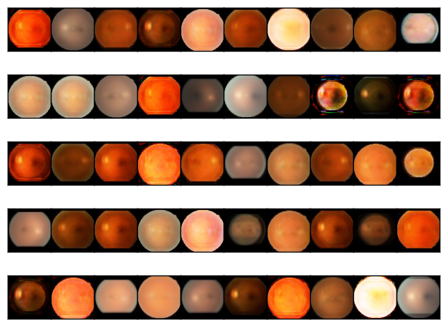

# MasterThesis

## Synopsis

The project is done as part of Advanced Methods in Intelligent Computing course at Lappeenranta University of Technolgoy Lappeenranta, Finland. The goal of the stuyd is to apply Convolutional Neural Networks for detection and classification of fishes from low-quality videos.

## Motivation

The rising level of environmental issues across the world leads researchers to understand the core of the problems and develop solutions for those issues. Extinction of some fish species is one of those important issues. One way to solve this problem for a particular area could be by simply observing fishes in this area. 

## Data 

The data files are provided under **data** file. Only the frames extracted from videos are provided under this folder.

## Code 

The implementation of LeNet and AlexNet based CNN architecture for given problem can be found under **src** file. Keras deep learning library is used to implement the architecture. 

## Graphical Results
### Generate GAN Images

### Generated VAE Images

### EyePACS similarity analysis
similarity matrix goes here

### Histogram Analysis

histogram figures go here

## Documentation

The problem with the solution is explained by giving detailed literature review of Convolutional Neural Netwroks related  in **Report.pdf**  under **doc** file.

## Tests

To able to run the code by yourself, you need to have Python environment with included libraries. After installing the all dependencies, All you need to do is to run the IPyhton Notebook. 

## Contributors
1. [Sinan Kaplan](https://www.linkedin.com/in/kaplansinan/)

## License

MIT
