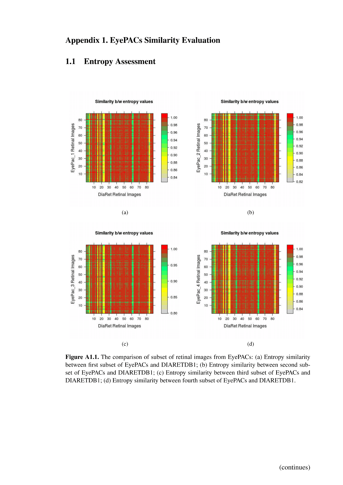
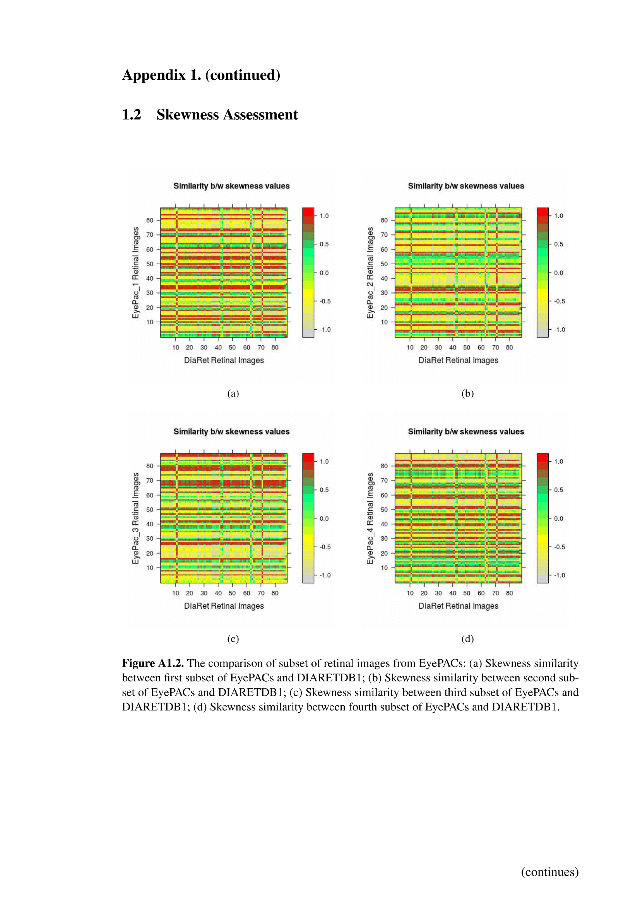
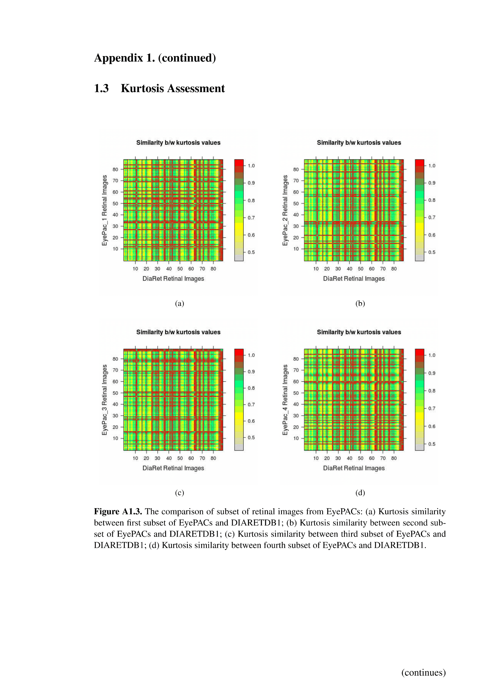
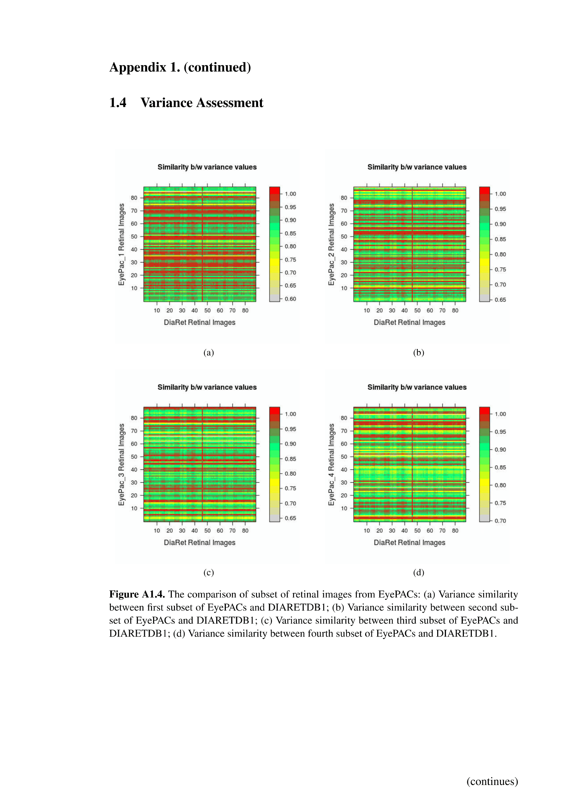
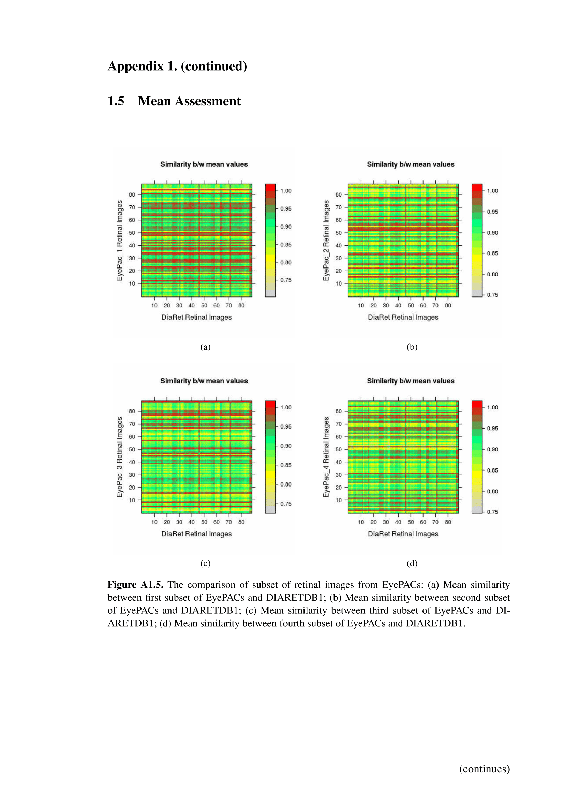
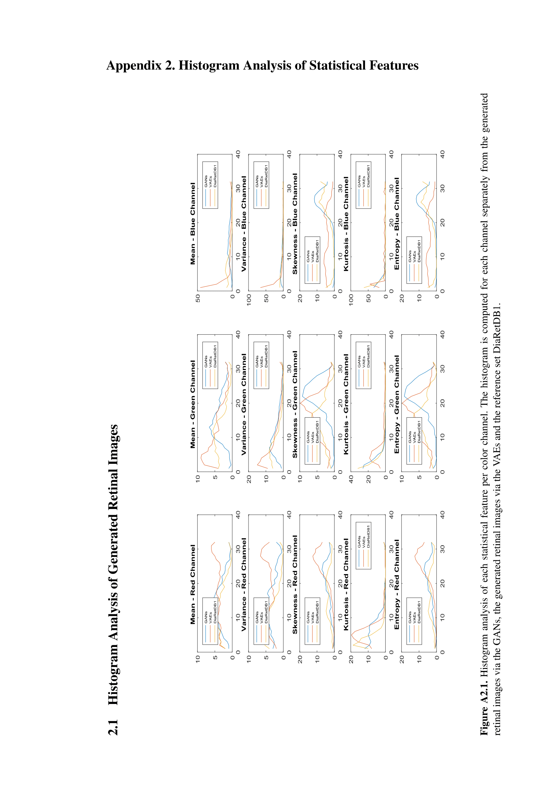

# MasterThesis

## Synopsis

The files presented here are as part of my master thesis conducted at [Lappeenranta Univeristy of Technology, Finland](https://www.lut.fi/).

The thesis can be found [here](http://www.doria.fi/handle/10024/143329). The figures presented below here are explained in more details in the thesis. Please check the thesis for more detailed and relevant information. 

## Motivation

Retinal images have been increasingly important in clinical diagnostics of several eye and systemic diseases. To help the medical
doctors in this work, automated diagnosis methods can be used to increase the efficiency of diagnostics processes and follow-up as
well as enable wider screening programs. However, the training of advanced machine learning methods for improved retinal image
analysis require large and representative retinal image datasets. While large datasets of retinal images are available, the accompanying
diagnostic information is generally image-wise, which limits the training and evaluation of generative models. One approach
to this issue is studying the possibility of generating sufficiently realistic synthetic data with known characteristics. 

## Code 

The code used to generate retinal images will be available here after the paper accepted to be published. 

## Graphical Results
### Generate GAN Images
Samplea of generated retinal images by GANs.

### Generated VAE Images
Samples of generated retinal images by VAEs.

### EyePACS similarity analysis
* Entropy

* Skewness

* Kurtosis

* Variance

* Mean

### Histogram Analysis
* Histogram Analysis of Generated Retinal Images

* Histogram Analysis of EyePACS set

## Contributors
1. [Sinan Kaplan](https://www.linkedin.com/in/kaplansinan/)

## License

MIT
